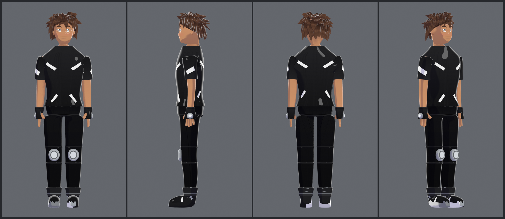
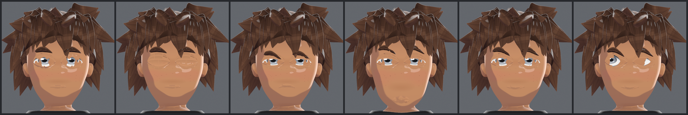
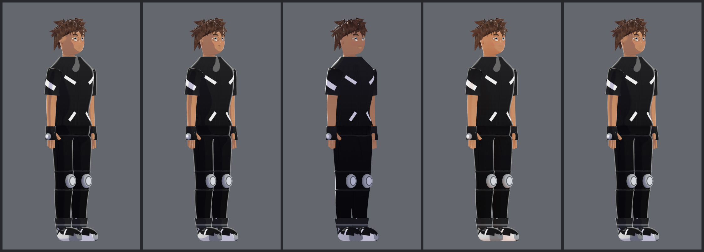
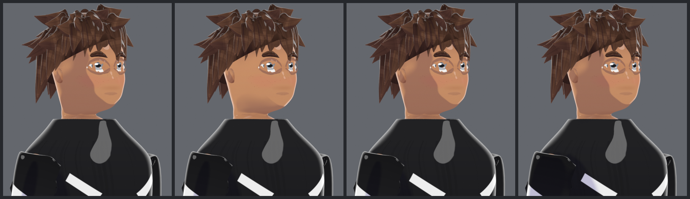

# Kaito — procedural anime character for Blender

A complete, rigged, cel-shaded anime character generated from code. The
built file — `kaito.blend` in the repository root — contains a smooth
subdivision-surface body, separate clothing pieces, seven texture
templates, a full-body IK skeleton, a face rig that shifts the eyebrows,
eyelids and mouth, and a dedicated **shadow rig** for art-directing the cel
shading. Open it in Blender 4.2+ and it is ready to pose; its textures are
packed, so nothing else is needed.

To rebuild it from source:

```
python3 build.py --out build/kaito.blend      # if the `bpy` module is installed
blender --background --python build.py -- --out build/kaito.blend
```

Then check it actually works:

```
python3 -m tools.verify --blend build/kaito.blend      # 96 rig checks
python3 -m tools.showcase --blend build/kaito.blend    # preview sheets
```

Everything is regenerated from `character/config.py`, so the character can
be re-proportioned, recoloured or re-textured by editing numbers rather
than by re-modelling.



The face rig, driven entirely by the slider bones and face properties —
neutral, blink, angry, surprised, smile, looking left:



The shadow rig sweeping its own controls. Same model, same pose; only
`SHD-ctrl` and `SHD-key` change between frames — default, hard key, low
key from behind, warm and soft, and the fringe shadow dropped down the
face:



Per-region grading. Same pose, same `SHD-ctrl`; only one region control
moves between frames — uniform, the face lifted, the hair hardened, the
body deepened:



---

## What you get

### Meshes — the clothing is separate from the character

| Object | What it is |
| --- | --- |
| `CHR-Body` | The base character: head, torso, arms, hands, legs, feet, ears. One watertight quad shell under a Subdivision Surface modifier. Two material slots — `MAT-SkinBody` below the neck, `MAT-Skin` above it — so the face grades separately from the body. |
| `CHR-Eye-L` / `-R` | Curved eye shells carrying the silver iris. Rotated by their own bones. |
| `CHR-LidUp-L/R`, `CHR-LidLo-L/R` | Eyelid shells with `blink` / `wide` / `squint` shape keys. |
| `CHR-Brow-L` / `-R` | Eyebrow shells with `up` / `down` / `angry` / `sad` / `raise` shape keys. |
| `CHR-Mouth`, `CHR-MouthCavity` | Lip shell with six shape keys, plus a dark pocket behind it. |
| `CHR-Hair` | Scalp shell plus ~60 layered clumps: fringe, side locks, crown spikes, back layers. |
| `CHR-Shirt` | Black tee with white flashes. **Separate object.** |
| `CHR-Pants` | Trousers with hexagonal knee plates and straps. **Separate object.** |
| `CHR-Shoes` | High-top trainers with white midsoles. **Separate object.** |
| `CHR-Gloves` | Fingerless gloves with knuckle plates. **Separate object.** |
| `CHR-ContactShadow` | The soft ground patch driven by the shadow rig. |

Garments are lofted from the *same* profile tables as the skin, offset
outward, so they fit automatically. Each is an open shell that gets its
thickness from a Solidify modifier — the way production clothing is built.

### Texture templates

Seven individual templates, each aligned to the UV atlas the model is built
with, written to `textures/generated/`:

`skin` · `hair` · `eyes` · `shirt` · `pants` · `shoes` · `gloves`

Every one ships twice: `<name>.png` is the texture the material loads, and
`<name>_guide.png` overlays the UV wireframe, the atlas rectangles and
their labels so you can repaint by hand without guesswork. See
[docs/TEXTURES.md](docs/TEXTURES.md).

### The rig

97 bones in eight bone collections. Full detail in
[docs/RIGGING.md](docs/RIGGING.md); the short version:

* **Body** — `root` → `torso` → spine → chest → neck → head, with
  shoulders, arms, five fingers per hand, legs, feet and toes.
* **IK** — two-bone IK on both arms and both legs with pole targets, an
  FK/IK blend per limb on the `properties` bone, and toe-roll controls.
  Pole targets are placed in the plane of the modelled bend and pole angles
  solved at build time, so switching IK on leaves the rest pose within a
  fraction of a millimetre.
* **Face** — `eye_target` aims both eyes; slider bones drive shape keys:
  pull `lid_up.L` down to blink, push `brow.R` up to raise an eyebrow, drag
  `mouth` down to open it. `jaw` is a real deform bone that opens the chin.
* **Shadow** — see below.

### The shadow rig

Cel shading makes shadow something you *pose*, so it gets its own bones and
its own controls on the same armature:

| Control | What it does |
| --- | --- |
| `SHD-key`, `SHD-fill`, `SHD-rim` | Light-direction handles. A Sun rides each bone, aimed down its length — point the bone, point the light, and the cel terminator sweeps across the whole character. |
| `SHD-ctrl` | 14 custom properties driving **every** toon material at once: terminator position and softness, shadow depth, shadow tint (RGB), rim light, specular, light energies, and cast-shadow softness. |
| `SUN-body`, `SUN-face`, `SUN-hair` | Per-region grading, in the `Sunvec` bone collection. Five offsets each, added on top of `SHD-ctrl`, so the face can read cleaner than the body and the hair harder than either without breaking the global control. |
| `SHD-face` | Slides the shadow the fringe casts up and down the forehead — the classic anime bang shadow, animatable per shot. |
| `SHD-contact` | Carries the ground contact patch: move it, scale it, fade it. |

81 drivers connect `SHD-ctrl` and the three region controls to the
materials, so one slider retints or re-thresholds the entire character —
and three more pull each region away from it.

### The shader

Every material routes through one shared node group, `TOON-Core`, whose
interface deliberately mirrors the `Yang_Shader` group of the reference rig
this project was built to match:

| Input | What it takes |
| --- | --- |
| `Normal` | a normal to shade with instead of the geometry normal |
| `Lit` | the colour on the light side of the terminator |
| `Shaded` | the colour on the dark side |
| `Shade Map` | biases *where* the terminator falls, per pixel |
| `Normals` | how far to blend `Normal` over the geometry normal |

returning `Result` (the shader), `ShadowMap` (the raw 0–1 terminator, useful
as a mask), and `Lit`/`Shaded`/`Normals` passed through.

The lit/shaded **pair** is the point. A cel character is not a texture that
gets darkened — it is two paintings, one per side of the terminator, and the
shader picks between them. Supply only `Lit` and `Shaded` is derived from it
through `Shadow Tint`, so nothing breaks if you never paint one.

Inside: a Diffuse BSDF → *Shader to RGB* → threshold → `Mix(Shaded, Lit)`,
with the shade map, a per-vertex `shade` attribute and backfacing folded
into the threshold, and the rim/specular terms added on top.

---

## Matching the reference rig

The shading architecture here is modelled on a production anime rig
(`_Yang_EV_Rig_Master.blend`, Blender 4.3, EEVEE). What was taken from it,
and what deliberately was not:

| Reference | Here |
| --- | --- |
| One `Yang_Shader` group instanced into ~24 materials | One `TOON-Core` group, same five-input interface, instanced into 9 |
| Lit/Shaded colour pair per material | Same — `Lit` painted, `Shaded` painted or derived |
| Per-material normal chain into the group's `Normal` | Same, fed by `textures/input/<piece>_normal.png` |
| `Skin` and `Skin Body` as separate materials | `MAT-Skin` / `MAT-SkinBody`, two slots on one mesh |
| Three suns (Body/Face/Hair) in three collections | Three region controls in a `Sunvec` bone collection — see below |
| `Sunvec` bone collection steering the shading | Same name, same job |
| 25 separate meshes, armature modifier only | 13 meshes; garments already separate objects |
| Three armatures (BODY 584 / FACE 648 / PHYSICS 297 bones) | One armature, 97 bones |
| Grease Pencil Line Art (3 objects) | not implemented |
| Geometry-Nodes shadow casters (`Simple_Shadow_Gen_GN`, `Points_to_Shadow`) driven by 23 `_Pos` helper objects | not implemented — the bang shadow is a height band on `MAT-Skin` instead |
| `Shader Info` node (half-lambert, cast/self shadows) | not available — it is a third-party node, absent from stock Blender; the equivalent term comes from Diffuse BSDF → Shader to RGB |

**On the three suns.** The reference lights body, face and hair separately
so each can be art-directed alone. The obvious way to reproduce that is
Blender's light linking — but **EEVEE Next ignores it**. That was checked,
not assumed: rendering one scene twice, once with the sun's receiver
collection emptied, gives a mean pixel value of 0.7210 both times. So the
separation is made in the materials instead, which is also where the
reference's own `BASE_SunBody_Group` / `SunFace` / `SunHair` split lives.

Note also that the reference file contains exactly **one** image texture
(`Eye_Texture.png`) — the rest of that character is procedural colour. This
project ships seven painted templates instead, and accepts hand-supplied
maps on top of them.

---

## Layout

```
build.py                 one-command build
character/
  config.py              every proportion, colour, UV rectangle and default
  meshlib.py             dependency-free mesh maths (rings, lofts, forks, UVs)
  surface.py             samples the skin so add-on parts sit flush
  blendutil.py           MeshData -> Blender object
  body.py                the base skin mesh
  face.py                eyes, eyelids, brows, mouth (+ their shape poses)
  hair.py                layered spiky hair
  clothing.py            shirt / pants / shoes / gloves
  materials.py           the shared cel-shading node group
  armature.py            skeleton, IK, widgets
  skinning.py            envelope weighting
  face_rig.py            slider bones -> shape key drivers
  shadow_rig.py          light bones, material drivers, contact shadow
  scene.py               render, world, camera, shadow catcher
  assemble.py            puts it all together
tools/
  generate_textures.py   the seven texture templates
  canvas.py              a tiny stdlib rasteriser (no Pillow, no numpy)
  png.py                 stdlib PNG read/write
  uvprobe.py             "where on the texture is this point on the model?"
  preview.py             orthographic turnaround renders
  showcase.py            turnaround / expression / shadow / region / pose sheets
  verify.py              96 checks that the rig actually responds
docs/
  RIGGING.md             every control, what it does, how to animate it
  TEXTURES.md            the UV atlas and how to repaint each map
  PIPELINE.md            how the generator works and how to change it
  images/                turnaround, expressions and shadow-rig sheets
kaito.blend              the built character, textures packed
textures/generated/      the seven templates plus their _guide overlays
```

`tools/` has **no third-party dependencies** — the texture generator writes
PNGs with nothing but `zlib` and `struct`, so `make textures` works on a
bare Python install and inside Blender's bundled interpreter alike.

## Requirements

Blender **4.2 or newer** (developed and verified against 5.0). Either the
Blender application, or the `bpy` PyPI module for headless builds:

```
pip install bpy
```

The materials use *Shader to RGB*, which is an EEVEE node — the file is
saved with EEVEE Next as the render engine. Under Cycles the materials fall
back to their flat base colour.

## Common changes

| Goal | Where |
| --- | --- |
| Taller, shorter, wider, different build | `HEIGHT`, `TORSO_RINGS`, `HEAD_RINGS`, `ARM_PATH`, `LEG_PATH` in `config.py` |
| Different colours | `PALETTE` in `config.py`, then `--regen-textures` |
| Different hairstyle | the band functions in `hair.py` |
| Different clothing cut | `SHIRT`, `PANTS`, `SHOE`, `GLOVE`, `CLOTH` in `config.py` |
| Repaint a map by hand | edit `textures/generated/<name>.png`; the material reloads it |
| Supply your own maps | drop `<piece>_color/_shaded/_normal/_shade.png` in `textures/input/` — see [textures/input/README.md](textures/input/README.md) |
| Grade one region only | `SUN-body` / `SUN-face` / `SUN-hair` offsets |
| Default shadow look | `SHADOW` in `config.py` |

Re-run `build.py` after any change, then `tools/verify.py` to confirm the
rig still responds.
